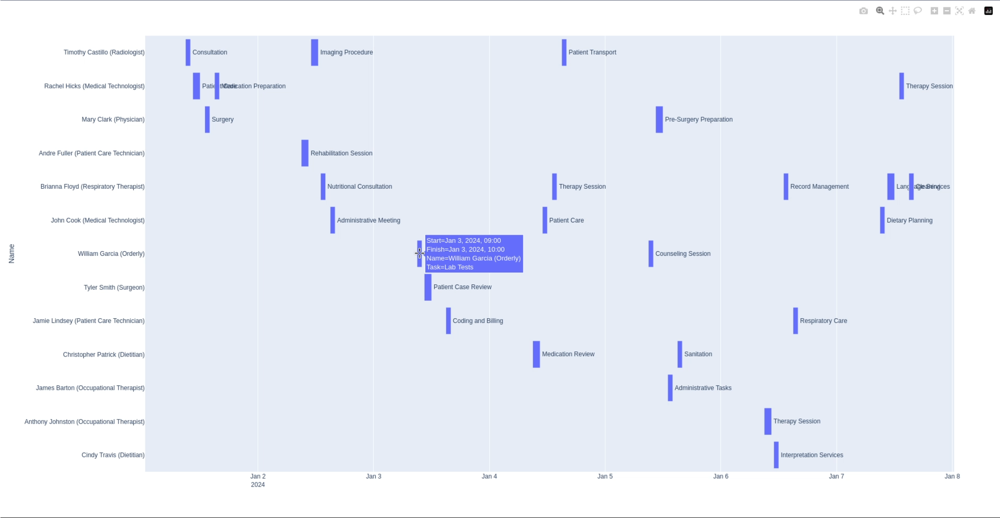

# Med plan creator

## Application Description

The application focuses on creating the most efficient weekly schedule for a group of employees and presenting it in a graphical format. The project considers the following factors:

- **Employee availability** (Is the employee working at the given time?)
- **Employee specialization** (Does the employee have the necessary skills or profession to complete the task?)
- **Task conflicts** (Does this task overlap with other tasks the employee is assigned to?)
- **Cost efficiency** (Is there another employee who is less expensive that could complete the task?)

Once the application generates the appropriate plan, it will be automatically displayed in the default web browser.



## How to Run the Demo

### 1. Create a Python environment
```sh
python3 -m venv .
```

### 2. Activate the environment

**Linux**
```sh
source bin/activate
```

**Windows**
```ps
Scripts\activate
```


### 3. Install the required dependencies from the 'requirements.txt' file
```sh
pip install -r requirements.txt
```

### 4. Run the 'main.py' file
```sh
python3 src/main.py
```

### 5. Wait for the browser window to open (<1min)

As a result, the application will return a fitness function: the file 'answers.png' and the final results. A visual representation of the plan will also be displayed.

## How to Use

To customize the project to your needs, you need to modify 3 files:

- **'professionsList.json'** - The professions database. It defines the possible professions of employees and the types of tasks that can be performed by employees with specific skills (The key is a specific profession, and the list contains the types of tasks that an employee can perform).
- **'workers.json'** - The employee database. It contains a list of all employees, including their profession (consistent with the 'professionsList.json' file), name, hourly wage, and a dictionary specifying the employee's availability on specific days (where 0-6 represent specific days of the week, and the value is the hours in the format "<startHour>:<endHour>" - "HH-mm").
- **'schedule.json'** - This is a list of dictionaries containing tasks to be performed on specific days. It includes a number representing a specific day and a list of tasks for that day. The "role" key must match the roles in the 'professionsList.json' file. "Activity" is a short description of the task.


### Modifying Parameters

The **'planResolver.py'** file contains 'penalties' and 'rewards' for the genetic algorithm. If the program returns a suboptimal plan, these may need to be adjusted. For complex schedules, it may be necessary to increase the number of iterations (the default value in the program is 200). Increasing the number of iterations significantly affects the program's execution time.